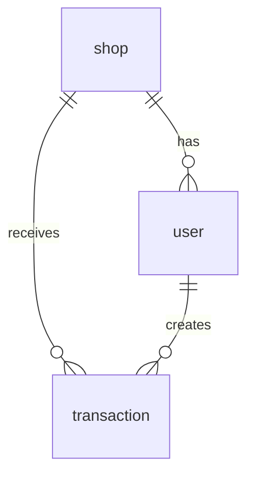

# Database Schema - WebServices Sun Pear

Database engine: MongoDB via Mongoose.
Source files: `backend/src/model/*.js` and sample exports in `backend/MongoJson`.

## Collections

### `transaction`

Defined schema in `backend/src/model/transactionModel.js`.

| Field | Type | Required | Notes |
| --- | --- | --- | --- |
| `_id` | ObjectId | Auto | MongoDB generated ID |
| `transaction_id` | String | Yes | Unique transaction ID |
| `shop_id` | ObjectId | Yes | Reference to `shop` collection |
| `table_id` | String/null | No | Related table ID |
| `username` | String | Yes | User who created/owns the transaction |
| `order` | Array | No | Ordered menu items |
| `subtotal` | Number | No | Subtotal before service/tax |
| `service_charge_rate` | Number | No | Service charge rate |
| `tax_rate` | Number | No | Tax rate |
| `tax_amount` | Number | No | Tax amount |
| `grand_total` | Number | No | Final total |
| `payment_method` | String | No | `cash` or `qr` |
| `cash_received` | Number | No | Cash amount received |
| `status` | String | No | `pending`, `paid`, or `cancelled` |
| `create_at` | Date | Auto | Created timestamp |
| `paid_at` | Date | No | Payment timestamp |

#### `transaction.order[]`

| Field | Type | Notes |
| --- | --- | --- |
| `menu_id` | String | Menu item ID |
| `menu_name` | String | Menu item name |
| `amount` | Number | Quantity |
| `menu_price` | Number | Unit price |
| `menu_options` | Array | Selected options |
| `menu_desc` | String | Description/note |
| `subtotal` | Number | Line subtotal |

#### `transaction.order[].menu_options[]`

| Field | Type | Notes |
| --- | --- | --- |
| `option_id` | String | Option ID |
| `option_name` | String | Option name |
| `option_price` | Number | Extra price |

### `shop`

Flexible collection (`strict: false`) in `backend/src/model/shopModel.js`.

| Field | Type | Notes |
| --- | --- | --- |
| `_id` | ObjectId | MongoDB ID |
| `shop_name` / `name` | String | Shop name |
| `tel` | String | Shop telephone |
| `is_open` | Boolean | Used by shop open middleware when present |
| `menus` | Array | Menu data when embedded |
| `tables` | Array | Table data when embedded |
| other fields | Any | Stored as flexible MongoDB document data |

### `user`

Flexible collection (`strict: false`) in `backend/src/model/userModel.js`.

| Field | Type | Notes |
| --- | --- | --- |
| `_id` | ObjectId | MongoDB ID |
| `username` | String | Login username |
| `password` | String | Hashed password |
| `role` | String | Owner/admin/worker role depending on app data |
| `shop_id` | ObjectId/String | Related shop |
| `email` | String | Email for login/reset when present |
| `tel` | String | Phone number when present |
| other fields | Any | Stored as flexible MongoDB document data |

## Relationship Diagram

